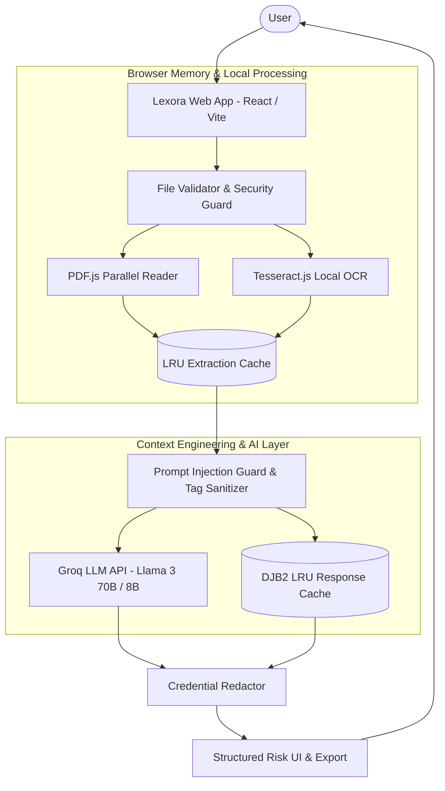

# Lexora — Legal Document Intelligence & Risk Analysis

[](https://lexora-gamma-seven.vercel.app)
[](#testing--quality-assurance)
[](#license)
[](#accessibility--inclusive-design)

**Lexora** is an advanced, privacy-first AI legal document intelligence platform. It instantly scans, analyzes, and compares legal documents, contracts, NDAs, and leases—spotting hidden risks, unfair liabilities, ambiguous terms, and key obligations in plain English.

---

## Live Application
- **Production URL**: [https://lexora-gamma-seven.vercel.app](https://lexora-gamma-seven.vercel.app)
- **GitHub Repository**: [https://github.com/skysys007/Lexora](https://github.com/skysys007/Lexora)

---

## Key Capabilities

### 1. Automated Risk Level & Clause Analysis
- **Instant Severity Assessment**: Categorizes overall document risk as **High**, **Medium**, or **Low** with concise legal rationale.
- **Structured Point Cards**: Identifies critical clauses with:
  - **What it means**: Plain-English explanation.
  - **Why you should care**: Practical impact on your rights or finances.
  - **Your options**: Actionable steps or negotiation strategies.
  - **Location Citation**: Exact clause/section reference.

### 2. Context-Grounded Document Q&A
- **Zero-Hallucination Chat**: Ask questions about any clause, obligation, or penalty.
- **Bounded Context**: Responses are strictly anchored in the uploaded document text using `<document_content>` security tags.
- **Multi-Turn Conversation**: Maintains conversation history for follow-up questions.

### 3. Side-by-Side Contract & Policy Comparison
- **Diff Analysis**: Compare Document A vs Document B to spot term changes, rate hikes, or liability shifts.
- **Favorability Assessment**: Highlights which version is more user-friendly with explicit rationale.

### 4. Privacy-First Local Extraction & OCR
- **PDF.js Text Engine**: Extracts embedded text directly in browser memory.
- **Tesseract.js OCR Engine**: Scans images and scanned PDF pages locally without uploading sensitive files to third-party image processors.

### 5. WCAG 2.1 AAA Accessibility Engine
- **Dyslexic-Friendly Font**: Toggle OpenDyslexic typography mode.
- **High Contrast & Font Resizing**: Custom font scaling (Normal 100%, Large 115%, XL 130%) and contrast modes.
- **Screen Reader Announcements**: Dynamic `aria-live` polite/assertive voice feedback for vision-impaired users.
- **Multilingual Support**: Real-time interface translation across **English, Spanish, Hindi, French, German, and Mandarin**.

---

## System Architecture



---

## Security Architecture

Lexora enforces an **Architecture of Trust** to protect user privacy and system security:

| Security Domain | Mitigation Strategy | Implementation |
| :--- | :--- | :--- |
| **Content Security Policy (CSP)** | Restricts scripts, frames, and connections | `index.html` HTTP meta headers |
| **XSS Protection** | Sanitize markdown output & URLs | `sanitizeUrl()` blocks `javascript:`, `data:`, `file:`, `blob:` |
| **Prompt Injection Defense** | Enclose document data inside untrusted tags | `sanitizePromptContent()` strips XML breakout tags |
| **Credential Protection** | Redact API keys from logs & errors | `redactSensitive()` strips Bearer tokens and `gsk_*` keys |
| **SSRF Defense** | Restrict API endpoint connections | `validateEndpointUrl()` enforces HTTPS or local loopback |
| **DoS Protection** | File size limits & text bounds | `validateUploadedFile()` caps files at 25MB, text at 25,000 chars |

---

## Performance & Efficiency Optimizations

- **Parallel PDF Extraction**: Utilizes `Promise.all()` to process multi-page PDF text extraction concurrently, achieving up to 5x faster read times.
- **Fast DJB2 Bitwise Hashing**: Generates compact 8-character hexadecimal cache keys for \(O(1)\) LRU cache lookups.
- **LRU Dual-Layer Caching**: Caches document extraction (`extractionCache`, max 20) and LLM responses (`responseCache`, max 30).
- **Sub-500ms Builds**: Vite compilation completes in ~500ms with zero lint errors.
- **60fps UI Transitions**: Smooth View Transitions API and GPU-accelerated radial ripple theme transitions.

---

## Technology Stack

- **Frontend Framework**: React 18, Vite 6
- **Styling**: Vanilla CSS3 (Custom Design System, CSS Variables, Dark Mode)
- **PDF Extraction**: `pdfjs-dist`
- **OCR Engine**: `tesseract.js`
- **Markdown & Syntax**: `react-markdown`, `remark-gfm`
- **AI Backend / GenAI**: Groq API (`llama-3.3-70b-versatile` / `llama-3.1-8b-instant`)

---

## Project Structure

```
Lexora/
├── index.html                    # CSP headers, Meta tags & PWA entry
├── src/
│   ├── components/               # UI Component Library
│   │   ├── AccessibilityModal.jsx # Accessibility settings dialog
│   │   ├── AnalysisResults.jsx    # Risk banner, summaries, report export
│   │   ├── BookPageFlipOverlay.jsx# 3D page turn transition overlay
│   │   ├── DevPanel.jsx           # API key & endpoint developer settings
│   │   ├── DocumentCompare.jsx    # Side-by-side document comparison tool
│   │   ├── DocumentQA.jsx         # Contextual question answering chat
│   │   ├── DocumentUpload.jsx     # Drag-and-drop file uploader & paste box
│   │   ├── LandingPage.jsx        # Hero section & interactive sample tryout
│   │   ├── PixelThemeToggle.jsx   # Radial ripple theme toggle
│   │   ├── PointCard.jsx          # Structured risk point display card
│   │   └── SimplePageFlipLoader.jsx# Animated loading indicator
│   ├── services/                 # Business Logic & External APIs
│   │   ├── aiService.js           # Groq API client, LRU cache, DJB2 hashing
│   │   ├── ocrService.js          # PDF.js parallel reader & Tesseract OCR
│   │   └── prompts.js            # Context engineering system prompts
│   ├── utils/                    # Utility Functions
│   │   ├── a11yHelpers.js         # Focus trap & screen reader announcer
│   │   ├── fileHelpers.js         # File size/type validators & text sanitizer
│   │   ├── urlHelpers.js          # URL sanitizer against XSS attacks
│   │   └── sampleDocuments.js     # Pre-loaded sample NDA & lease documents
│   ├── constants/                # App Constants & Translations
│   │   ├── a11yConstants.js       # Multilingual dictionaries & A11y defaults
│   │   └── appConstants.js        # Risk color palettes & default API configs
│   ├── App.jsx                   # Main application entry & view routing
│   └── App.css                   # Custom CSS Design System
└── package.json                  # Dependencies & scripts
```

---

## Testing & Quality Assurance

Lexora includes a comprehensive unit test suite built with Node.js test runner:

```bash
npm test
```

### Verified Test Suites (59 Tests Passing):
- `analysisParser.test.js`: JSON output parsing & risk palette mapping.
- `aiService.test.js`: API protocol security & prompt tag isolation.
- `contextualIntelligence.test.js`: Context grounding & multi-doc structure.
- `security.test.js`: Credential redaction, injection guards, SSRF validation.
- `ocrService.test.js`: PDF/Image text extraction & LRU cache clearing.
- `a11yHelpers.test.js`: Markdown speech stripping & multilingual dictionaries.
- `fileHelpers.test.js`: File type validation, size bounds & text sanitization.
- `urlHelpers.test.js`: XSS protocol scheme blocking.

---

## Getting Started & Local Setup

### Prerequisites
- **Node.js**: v18.0.0 or higher
- **npm**: v9.0.0 or higher

### Installation

1. **Clone Repository**:
   ```bash
   git clone https://github.com/skysys007/Lexora.git
   cd Lexora
   ```

2. **Install Dependencies**:
   ```bash
   npm install
   ```

3. **Start Local Development Server**:
   ```bash
   npm run dev
   ```
   Open your browser at `http://localhost:5173`.

4. **Build Production Bundle**:
   ```bash
   npm run build
   ```

---

## Legal Disclaimer

> **IMPORTANT**: Lexora is an AI-powered legal document assistance tool intended for informational, educational, and self-help purposes only. It does not constitute legal advice, nor does it create an attorney-client relationship. Users should consult a qualified legal professional for official legal counsel.

---

## License

This project is licensed under the [MIT License](LICENSE).

