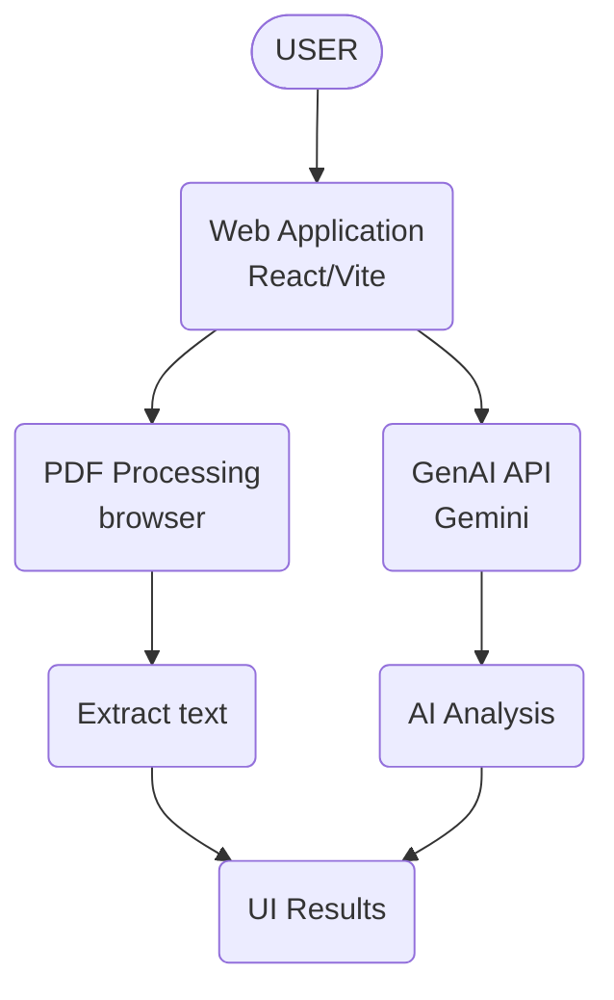

# Lexora

Lexora is an AI-powered legal document analysis web application designed to help users understand, analyze, and process complex legal documents. It runs primarily in the browser to ensure privacy and fast processing.

## 🚀 Potential Use Cases
- Simplifying complex legal documents
- Comparing contracts, agreements, or policies
- Highlighting important clauses, obligations, risks, or inconsistencies
- Answering questions based on provided legal documents
- Helping users understand their options and potential next steps
- Generating summaries, checklists, or other actionable outputs
- Helping users prepare information or questions for a legal professional

> **NOTE:** 
> - Solutions should provide information and assistance, rather than replace professional legal advice.
> - The use cases listed above are intended as potential directions and are not exhaustive or prescriptive.

## 🏗️ Architecture

## 🛠️ Tech Stack & Requirements

| Requirement          | Tool                | Runs where   |
| -------------------- | ------------------- | ------------ |
| UI                   | **React + Vite**    | Browser      |
| PDF reading          | **PDF.js**          | Browser      |
| OCR for scanned PDFs | **Tesseract.js**    | Browser      |
| GenAI                | **Gemini API**      | Google's API |
| Local AI             | **WebLLM**          | Browser      |
| Local embeddings     | **Transformers.js** | Browser      |
| Local storage        | **IndexedDB**       | Browser      |
